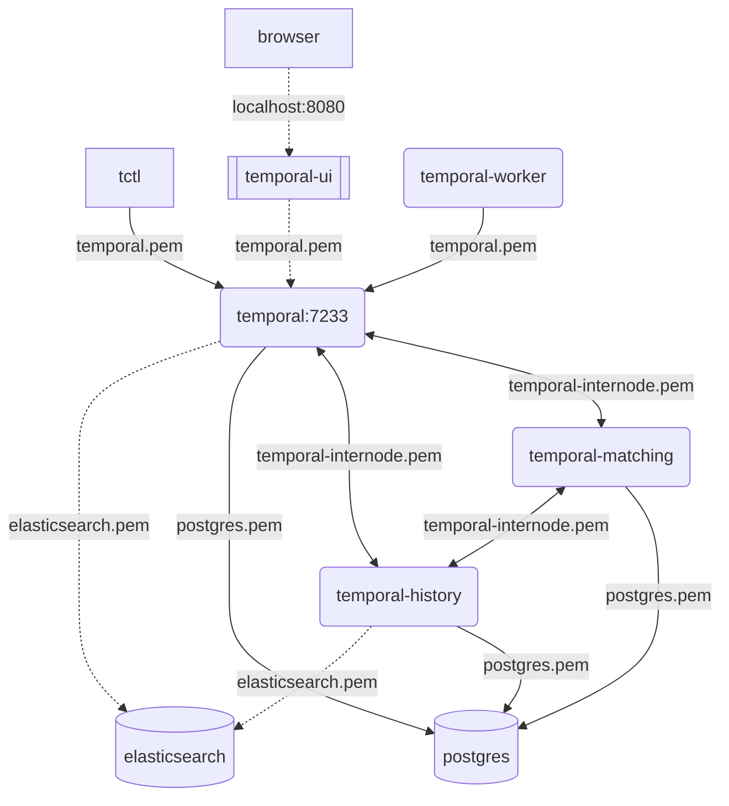

# Temporal with tls enabled (almost) everywhere

the temporal-ui is accessed via http to localhost, everything else has encryption enabled

## Execute

run from a shell

`./tls/run-tls.sh`

## Connecting locally

Setting these variables are required for your local tctl client to connect with encryption
to the exposed port on the temporal container.

```bash
TEMPORAL_CLI_TLS_SERVER_NAME=temporal TEMPORAL_CLI_TLS_CA=./.pki/ca.pem tctl cluster health
temporal.api.workflowservice.v1.WorkflowService: SERVING
```

## Script source with comments
```bash
#!/usr/bin/env bash
set -xe

# Build container image for generating cert material
docker build -t temporal_tls:test -f ${PWD}/tls/Dockerfile.tls .
mkdir -p .pki

# Run container to name volume and copy out CA certificate
docker run --rm -v temporal_tls_pki:/pki -v ${PWD}/.pki:/pki-out temporal_tls:test

# Build extra layers which copy in CA certificate to local trust store
# Allows for not having to disable host verification on TLS connections
COMPOSE_PROJECT_NAME=tls_test docker-compose -f docker-compose-tls.yml build --no-cache

# Run example docker-compose environment with elasticsearch and postgresql protected with TLS
COMPOSE_PROJECT_NAME=tls_test docker-compose -f docker-compose-tls.yml up

```

## encrypted communication channels



> Original source from [Temporal Server self-hosted production deployment](https://docs.temporal.io/docs/server/production-deployment)
